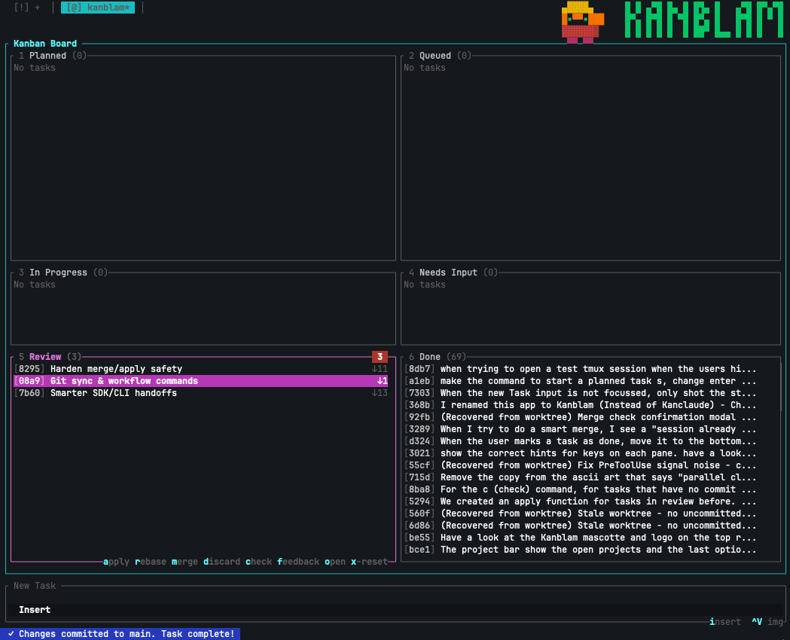

# KanBlam!

```
  ▄▓▓▓▓▄      █ █ ▄▀█ █▄ █ ██▄ █   ▄▀█ █▀▄▀█
  ▓ ▀▀ ▓▒▒    █▀▄ █▀█ █ ▀█ █▀▄ █   █▀█ █ ▀ █
  ▓▓▓▓▓▓▒     █ █ █ █ █  █ ██▀ █▄▄ █ █ █   █
   ▀▀ ▀▀
```

> **Open source by [Peerby](https://www.peerby.com)** — We're building the future of sharing. [Join us!](https://www.peerby.com/contact)

> **WARNING: This project is highly experimental and may destroy your code and repository. Use at your own risk. Always have backups and handle with care.**

**A TUI Kanban board for orchestrating parallel Claude Code sessions**

KanBlam! is a terminal-based task manager that lets you run multiple Claude Code AI coding sessions simultaneously, each in complete isolation through git worktrees. Plan your tasks, queue them up, and watch Claude work on them in parallel—then review, accept, or discard the results. It's vibe coding at the speed of sound.

*Desktop view*


*Mobile view via SSH on iPhone*


### The Problem

Running multiple Claude Code sessions is powerful, but it quickly becomes chaotic. You've got Claude working on a feature in one terminal, fixing a bug in another, and refactoring something in a third. Before you know it, you're juggling tmux panes, losing track of which session is doing what, forgetting to check on that task you started an hour ago, and accidentally committing to the wrong branch. Sound familiar?

KanBlam keeps you sane. It gives you a single dashboard to see all your Claude sessions at a glance, tracks their status automatically, and ensures each task runs in complete isolation so nothing steps on anything else.

### Work From Anywhere

Because KanBlam is a TUI (terminal user interface), it scales perfectly to any screen size—including your phone. Fire up a terminal client like [Termius](https://termius.com/index.html), connect to your home network with [Tailscale](https://tailscale.com/), and SSH into your dev machine, and manage your Claude sessions from the coffee shop, the couch, or the commute. Queue up tasks, check on progress, review and merge completed work—all from your pocket.

## Features

- **Parallel AI Sessions** — Run multiple Claude Code instances simultaneously, each working on different tasks
- **Git Worktree Isolation** — Each task gets its own worktree and branch, preventing conflicts between parallel sessions
- **AI merges** - Let Claude figure out resolve conflicts and to stitch the different worktrees back together
- **Kanban Workflow** — Visual board with columns: Planned → In Progress → QA → Review → Done
- **SDK Integration** — Deep integration with Claude Code Agent SDK for programmatic session control
- **Interactive Handoff** — Seamlessly switch between automated and interactive Claude sessions
- **Smart Notifications** — Audio alerts and tmux status updates when tasks need attention
- **AI Task Summaries** — Write your messy prompt and Claude will summarize it into a clear task title
- **Task Specifications** — Claude auto-generates structured specs with objectives, constraints, and acceptance criteria
- **Automated QA Validation** — Claude automatically runs tests and verifies spec compliance before review
- **Image Attachments** — Paste screenshots directly into task descriptions

## How It Works

```
┌─────────────────────────────────────────────────────────────────────┐
│  Your Codebase                                                      │
├─────────────────────────────────────────────────────────────────────┤
│                                                                     │
│   main branch ─────────────────────────────────────────────────►    │
│        │                                                            │
│        ├── worktree: task-abc123 (claude/abc123)                    │
│        │       └── Claude working on "Add dark mode"                │
│        │                                                            │
│        ├── worktree: task-def456 (claude/def456)                    │
│        │       └── Claude working on "Fix login bug"                │
│        │                                                            │
│        └── worktree: task-ghi789 (claude/ghi789)                    │
│                └── Claude working on "Update API docs"              │
│                                                                     │
└─────────────────────────────────────────────────────────────────────┘
```

1. **Plan** your tasks on the Kanban board and let Claude spec them
3. **Watch** as Claude works on multiple tasks in parallel (each in isolation) and tests them
4. **Review** the changes when Claude finishes
5. **Accept** to merge into main, or **Discard** to throw away the work

## Task Specifications

When you create or edit a task, KanBlam automatically generates a structured specification document. This spec serves as a contract between you and Claude, ensuring clear expectations and preventing scope creep.

**How it works:**
- Write a task description in plain language (can be messy/detailed)
- Claude generates a concise title for the kanban card
- Claude also generates a structured spec with:
  - **Objective** — One clear sentence describing the exact outcome
  - **Non-Goals** — What Claude should NOT do (prevents overreach)
  - **Constraints** — Hard rules like backward compatibility, style rules
  - **Outputs** — What must exist when done (files, tests, etc.)
  - **Definition of Done** — Concrete, verifiable completion criteria

The spec is shown in a dedicated "spec" tab when viewing task details and is used during QA validation.

## Automated QA Validation

When Claude finishes working on a task, KanBlam automatically runs a QA validation phase before moving the task to Review. This catches issues early and reduces back-and-forth.

**QA validation checks:**
1. **Tests** — Runs the project's test suite
2. **Build** — Verifies the project compiles without errors
3. **Spec Compliance** — Reviews changes against task requirements

**QA outcomes:**
- **Pass** — Task moves to Review for your final approval
- **Fail** — Claude automatically fixes the issues and retries (up to configurable max attempts)
- **Max attempts exceeded** — Task moves to NeedsWork with a warning indicator

**Configuration** (via `Ctrl+P` settings):
- **QA Enabled** — Toggle automatic QA on/off per project
- **Max QA Attempts** — How many retry attempts before giving up (default: 3)

## Installation

### Prerequisites

- **Rust** (1.70+) — for building the TUI
- **Node.js** (18+) — for the sidecar process
- **tmux** — for managing Claude sessions
- **Claude Code CLI** — the AI coding assistant

### Build from Source

```bash
# Clone the repository
git clone https://github.com/Peerby/kanblam.git
cd kanblam

# Build the Rust TUI
cargo build --release

# Set up the sidecar
cd sidecar
npm install
npm run build
```

### Run

```bash
# Start KanBlam
cargo run --release
```

## Usage

### Keyboard Shortcuts

#### Navigation
| Key | Action |
|-----|--------|
| `h/j/k/l` | Navigate (vim-style) |
| `←/↓/↑/→` | Navigate (arrow keys) |
| `1-6` | Jump to column (Planned, InProgress, Testing, NeedsWork, Review, Done) |
| `Tab` | Cycle focus (Board → Input → Projects) |
| `Enter` / `Space` / `v` | View task details |
| `?` | Help |

#### Task Actions
| Key | Action |
|-----|--------|
| `i` | Enter input mode (create/edit task) |
| `e` | Edit selected task |
| `s` | Start task (Planned/Queued) or continue task (Review/NeedsWork) |
| `o` | Open terminal view (tmux split with Claude + shell) |
| `O` | Open terminal in detached tmux (Shift+O) |
| `d` | Delete task, or Discard changes (in Review) |
| `+/-` | Move task up/down in list |

#### Review Actions
| Key | Action |
|-----|--------|
| `a` | Apply changes to main (for testing) |
| `u` | Unapply changes (revert applied changes) |
| `m` | Merge and mark done |
| `M` | Merge only (keep worktree) |
| `r` | Rebase worktree to latest main |
| `f` | Send feedback to Claude |
| `c` | Check if already merged (cleanup) |
| `x` | Reset task (cleanup worktree, move to Planned) |

#### Projects
| Key | Action |
|-----|--------|
| `!` | Open new project |
| `@#$%^&*(` | Switch to project 1-8 |
| `Ctrl+D` | Close current project |

#### Other
| Key | Action |
|-----|--------|
| `q` | Quit |
| `Ctrl+S` | Open settings |
| `Ctrl+V` | Paste image from clipboard |
| `Esc` (2x) | Show help hints |

### Task Lifecycle

```
                    ┌──────────┐
                    │ Planned  │  Create tasks, write descriptions
                    └────┬─────┘
                         │ queue
                         ▼
                    ┌──────────┐
                    │  Queued  │  Ready for Claude to pick up
                    └────┬─────┘
                         │ start
                         ▼
                    ┌──────────┐
                    │In Progress│  Claude is working on it
                    └────┬─────┘
                         │ done
                         ▼
                    ┌──────────┐
                    │ Testing  │  Automated QA validation
                    └────┬─────┘
                         │
              ┌──────────┴──────────┐
              │                     │
         (pass)                (fail/max attempts)
              ▼                     ▼
        ┌──────────┐          ┌──────────┐
        │  Review  │          │NeedsWork │  QA failed or needs help
        └────┬─────┘          └──────────┘
             │
     ┌───────┴───────┐
     ▼               ▼
┌──────────┐   ┌──────────┐
│   Done   │   │ Discarded│
└──────────┘   └──────────┘
```

## Architecture

KanBlam uses a hybrid Rust/TypeScript architecture:

```
┌─────────────────────────────────────────────────────────────────┐
│                        KanBlam TUI (Rust)                       │
│  ┌─────────────┐  ┌─────────────┐  ┌─────────────┐             │
│  │   Kanban    │  │   Worktree  │  │    Tmux     │             │
│  │    Board    │  │   Manager   │  │   Control   │             │
│  └─────────────┘  └─────────────┘  └─────────────┘             │
│                           │                                     │
│                    Unix Socket IPC                              │
│                           │                                     │
│  ┌─────────────────────────────────────────────────────────────┐│
│  │                   Sidecar (TypeScript)                      ││
│  │  ┌─────────────────────────────────────────────────────┐   ││
│  │  │            Claude Code Agent SDK                     │   ││
│  │  │    Session management, tool execution, streaming     │   ││
│  │  └─────────────────────────────────────────────────────┘   ││
│  └─────────────────────────────────────────────────────────────┘│
└─────────────────────────────────────────────────────────────────┘
```

### The Elm Architecture (TEA)

The TUI follows the Elm Architecture pattern:

- **Model** (`src/model/`) — All application state
- **Message** (`src/message.rs`) — Exhaustive enum of state changes
- **Update** (`src/app.rs`) — Pure state transitions
- **View** (`src/ui/`) — Renders state to terminal

### Key Components

| Component | Description |
|-----------|-------------|
| `src/worktree/` | Git worktree creation and management |
| `src/tmux/` | Tmux session/window/pane control |
| `src/sidecar/` | IPC client for TypeScript sidecar |
| `src/hooks/` | Claude Code hook integration |
| `src/notify/` | Audio and visual notifications |
| `sidecar/` | TypeScript SDK integration |

## Development

```bash
# Run the TUI in development
cargo run

# Run the sidecar in development
cd sidecar && npm run dev

# Type check the sidecar
cd sidecar && npm run typecheck

# Run tests
cd sidecar && npm test
```

## Why "KanBlam"?

It's a **Kan**ban board that goes **Blam!** — because when you're running multiple AI coding sessions in parallel, things get done fast.

Meet **Blam**, our mascot: a friendly little block character who represents the explosive productivity of parallel AI-assisted development.

## License

MIT — see [LICENSE](LICENSE)

---

<p align="center">
<b>Built with ❤️ by <a href="https://www.peerby.com">Peerby</a></b><br>
<i>We're on a mission to build the future of sharing. Interested in AI-powered development?</i><br>
<a href="https://www.peerby.com/contact">We're hiring!</a>
</p>
